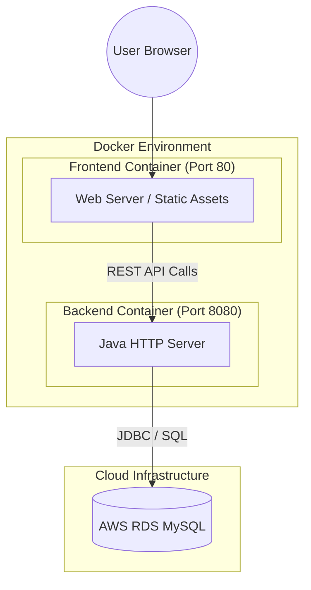
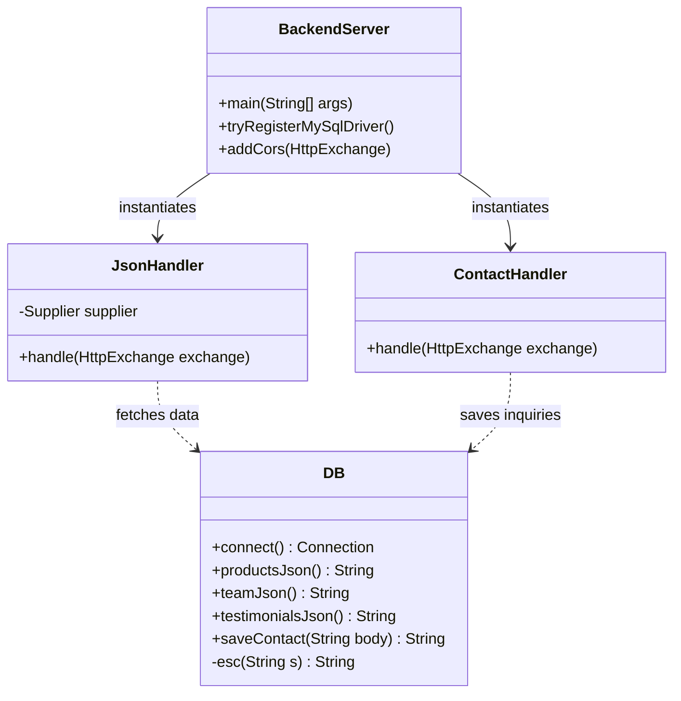
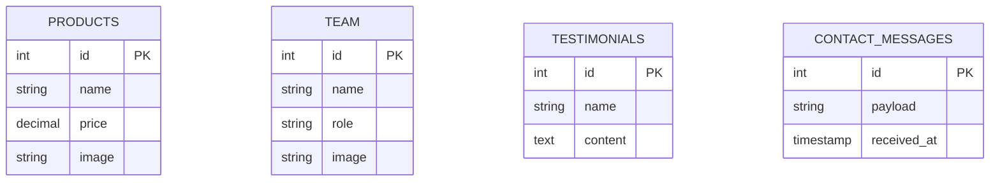
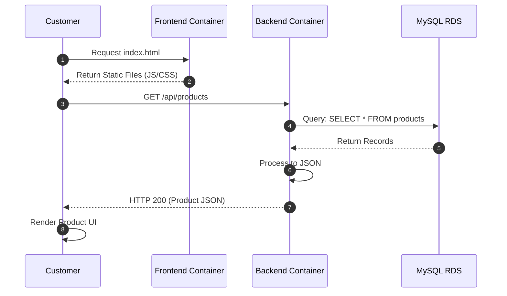
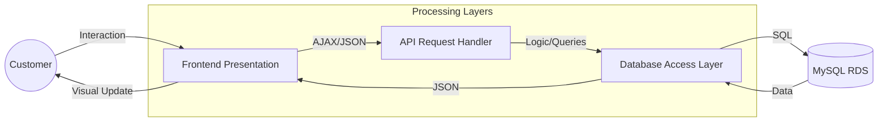

# Bakery Web Application - System Documentation

This repository contains a professional containerized Bakery Web Application. Below are the comprehensive system diagrams illustrating the architecture, data flow, and design patterns used in the project.

---

## 1. System Overview & Use Case Diagram
The Use Case Diagram defines the interactions between users and the system's core functionalities.

```mermaid
graph TD
    actor Customer
    actor Admin
    
    subgraph "Bakery Web System"
        UC1(Browse Products)
        UC2(View Team & Testimonials)
        UC3(Submit Contact Inquiry)
        UC4(Manage Database)
    end
    
    Customer --> UC1
    Customer --> UC2
    Customer --> UC3
    Admin --> UC4
    UC1 -.-> UC4 : <<include>>
```

---

## 2. Technical Architecture (Docker Deployment)
The application is built using a multi-container Docker architecture. It consists of a Frontend service, a Java Backend service, and an external MySQL RDS database.



---

## 3. Backend Class Diagram
This diagram shows the internal structure of the Java Backend, representing the relationships between the server, handlers, and the database interface.



---

## 4. Entity-Relationship (ER) Diagram
The database schema is designed to store product information, team details, testimonials, and customer inquiries.



---

## 5. Sequence Diagram (Product Loading Flow)
This diagram illustrates the sequence of events when a user visits the bakery website and views products.



---

## 6. Data Flow Diagram (DFD - Level 1)
A high-level view of how data flows from the user interface through the processing layers to the data storage.



---

## 7. Activity Diagram (Contact Form Process)
The logic flow for a customer submitting a contact inquiry.


---

## How to Run the Project
1. Ensure you have **Docker** and **Docker Compose** installed.
2. Update the `DB_URL`, `DB_USER`, and `DB_PASS` in `docker-compose.yml` with your RDS credentials.
3. Run the following command:
   ```bash
   docker-compose up --build
   ```
4. Access the application at `http://localhost`.
