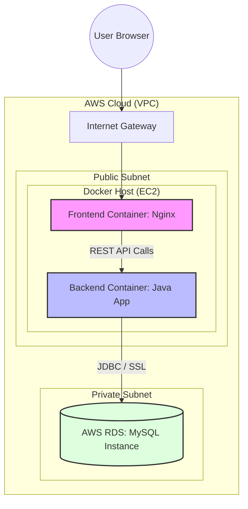
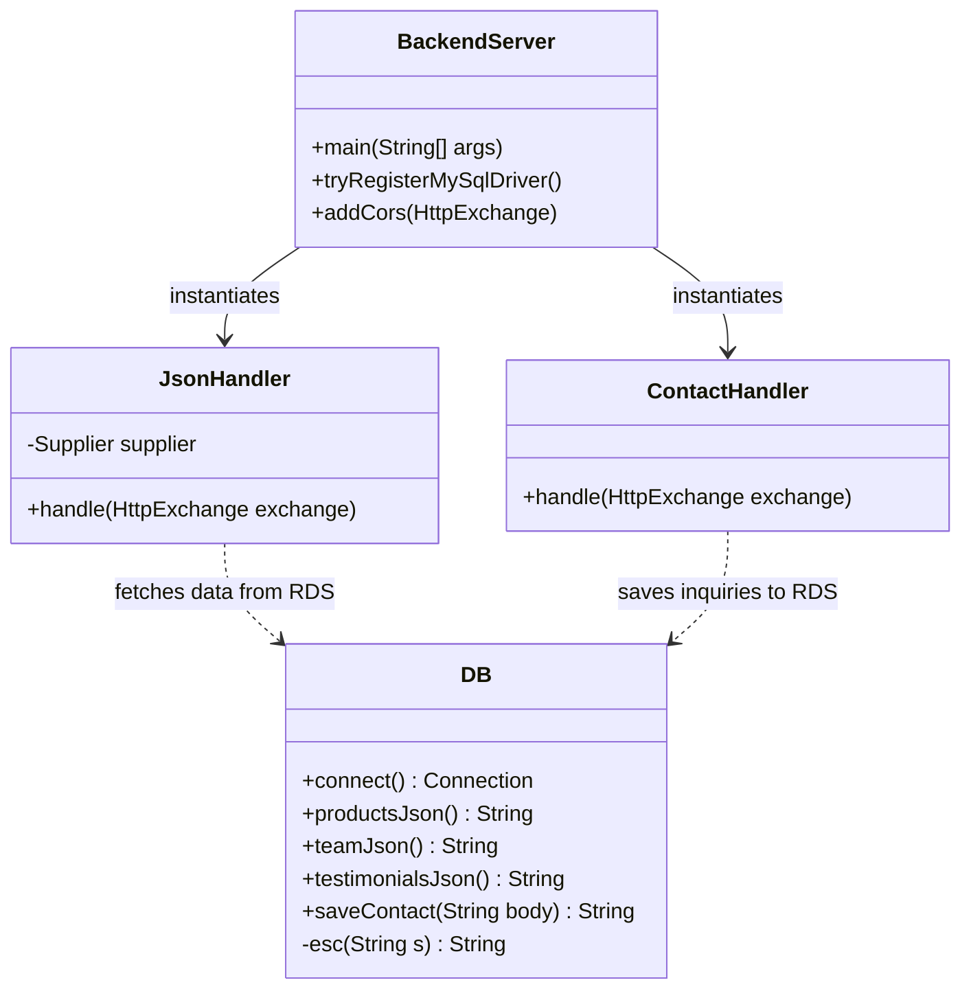
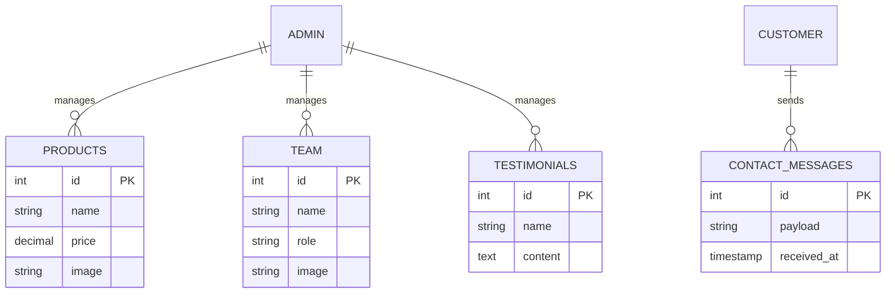
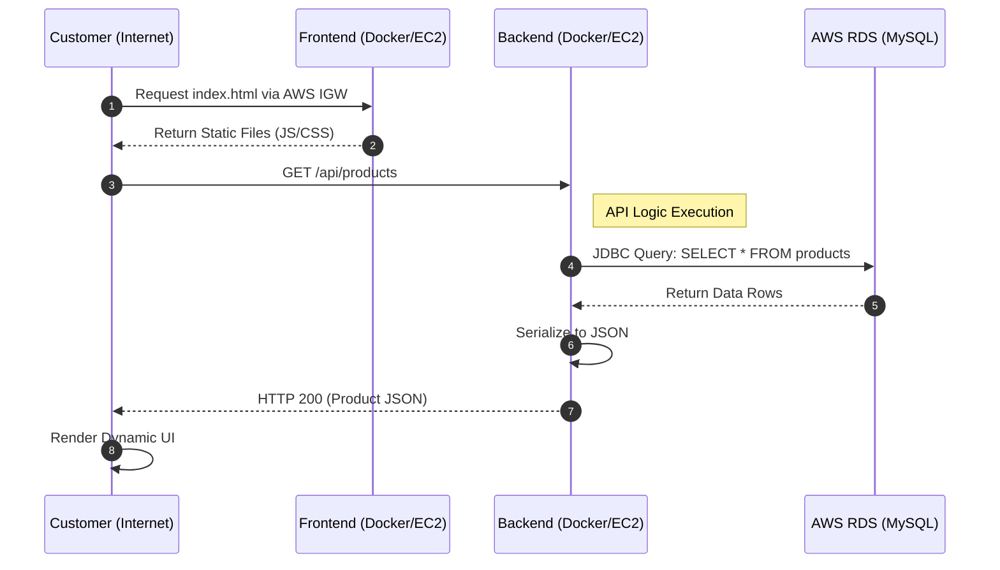
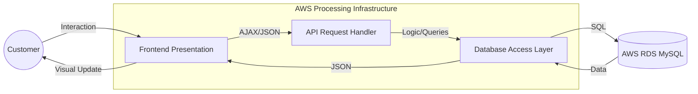
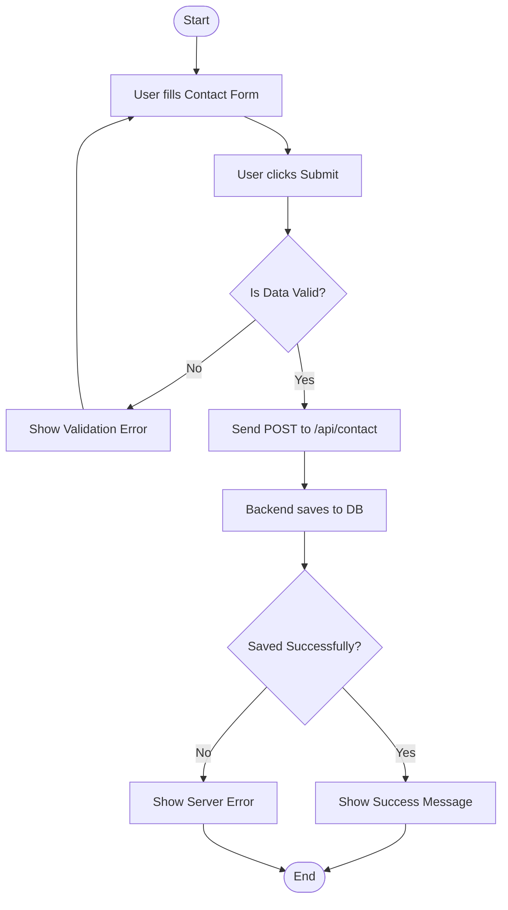

# Bakery Web Application - System Documentation

This repository contains a professional containerized Bakery Web Application. Below are the comprehensive system diagrams illustrating the architecture, data flow, and design patterns used in the project.

---

## 1. System Overview & Use Case Diagram
The Use Case Diagram defines the interactions between users and the system's core functionalities within the AWS Cloud environment.

```mermaid
usecaseDiagram
    actor "Customer" as C
    actor "Admin" as A
    
    package "AWS Cloud - Bakery System" {
        usecase "Browse Products" as UC1
        usecase "View Team & Testimonials" as UC2
        usecase "Submit Contact Inquiry" as UC3
        usecase "Manage Database (RDS)" as UC4
    }
    
    C --> UC1
    C --> UC2
    C --> UC3
    A --> UC4
    UC1 ..> UC4 : <<include>>
```

---

## 2. Technical Architecture (AWS & Docker Deployment)
The application is deployed using a multi-container Docker architecture hosted on AWS. It leverages AWS RDS for managed database services and Docker for service isolation.



---

## 3. Backend Class Diagram
This diagram shows the internal structure of the Java Backend, representing the relationships between the server, handlers, and the database interface.



---

## 4. Entity-Relationship (ER) Diagram
The database schema in AWS RDS is designed to store product information, team details, testimonials, and customer inquiries with clear relationships.



---

## 5. Sequence Diagram (AWS API Flow)
This diagram illustrates the sequence of events when a user visits the bakery website and views products, highlighting the cross-service communication.



---

## 6. Data Flow Diagram (DFD - AWS Environment)
A high-level view of how data flows from the user interface through the AWS-hosted processing layers to the RDS storage.



---

## 7. Activity Diagram (Contact Form Process)
The logic flow for a customer submitting a contact inquiry.



---

## How to Run the Project
1. Ensure you have **Docker** and **Docker Compose** installed.
2. Update the `DB_URL`, `DB_USER`, and `DB_PASS` in `docker-compose.yml` with your RDS credentials.
3. Run the following command:
   ```bash
   docker-compose up --build
   ```
4. Access the application at `http://localhost`.
